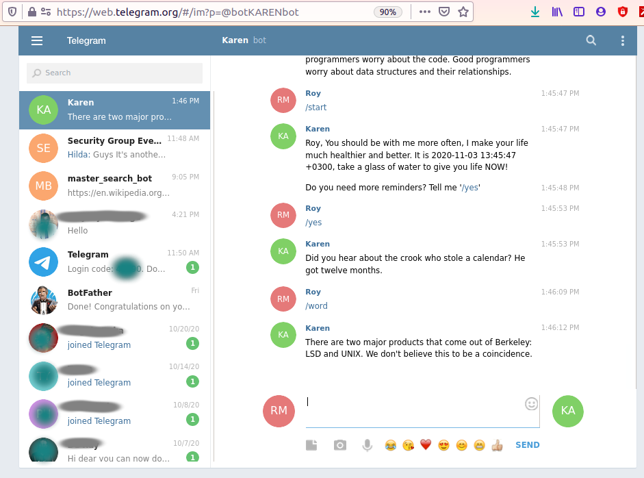
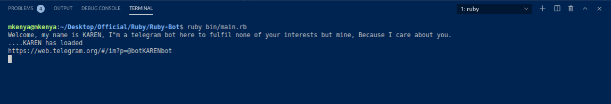

# The Telegram Bot

> In this project, I built a telegram bot as my personal assistant with only two purposes as of the November-2020. Karen, 'the telegram bot' is programmed to give hourly reminders to <b>take a glass of water</b> and <b>take short breaks while doing any activity</b>. 
> Karen will also give you motivation quotes on demand.
> Thoughout the project, I implemented TDD techniques of design, OOP principles through the classes and modules used.

## A screenshot of Karen at my service from the Telegram app

## A screenshot of Karen at my service from the terminal

## Live Video

[Project launch](https://www.loom.com/share/4e3c7ad09d8c4cb692ba9a59973f4640)

## Available commands for Karen

1. `/start` Karen will vent immediately to you and remind you to take water.
2. `/stop` receive a farewell message, with a 'drink water reminder'.
3. `/yes` Karen will give a random joke to keep you all smiles.
4. `/word` Karen gives a random motivation to keep your day going.

## Built With
* Ruby
* [Herokuapp Motivation Quotes](https://programming-quotes-api.herokuapp.com/quotes/lang/en)
* RSpec
* Rubocop

## Prerequisities

To get this project up and running locally, you must have ruby installed on your computer.

## Getting Started

**To get this project set up on your local machine, follow these simple steps:**

**Step 1** 
Navigate to the folder where you want to clone the repository and run 
`git clone https://github.com/mke2111/Ruby-Bot/tree/bot`.

**Step 2** 
Run `cd Ruby-Bot` to navigate into the root folder of the project 

**Step 3** 
Run `bundle` to install the gems from the `Gemfile`. 

**Step 4** 
Create an account with Telegram and search for the [Botfather](https://t.me/botfather). Follow the instructions and create a bot, you will then receive an API Token that looks like this: `1347431199:AAH4hPt6PDiJB4swk23Lb4oOzwocjKpba0S4` and the link to your bot 'https://web.telegram.org/#/im?p=replace-with-your-bot-link'. 

**step 5**
In the terminal, run `touch token.env` and store the API token for your bot in a variable named `TOKEN=`

**step 6**
Now run `ruby bin/mains.rb`, and Karen will start up in the terminal.

**step 7**
You can then communicate with Karen using the available commands stated above

## Tests

1. Open Terminal
2. Run the tests with the command while in the root folder: `rspec`

## Author

- GitHub: [@mke2111](https://github.com/mke2111)
- Twitter: [@Roymkenya](https://twitter.com/Roymkenya)
- LinkedIn: [Roy Mukuye](https://www.linkedin.com/in/roy-mukuye-42b07b1b4)

## Acknowledgement

- Thanks to all the contributors of [atipugin/telegram-bot-ruby](https://github.com/atipugin/telegram-bot-ruby) for the design inspirations and project guidance.

## 🤝 Contributing

> Our favourite contributions are those that help us improve the project:-

- Fork Contributions
- Issue
- Feature requests

Feel free to check the [issues page](https://github.com/mke2111/Ruby-Bot/issues) to create an issue.

## Show your support

If you've read this far....give us a ⭐️!